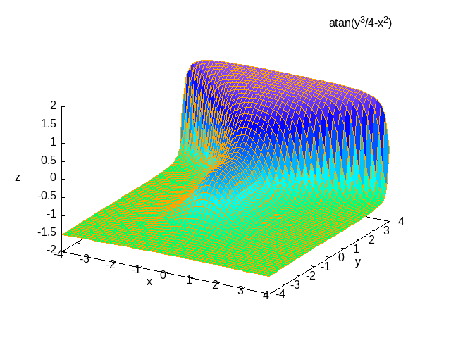
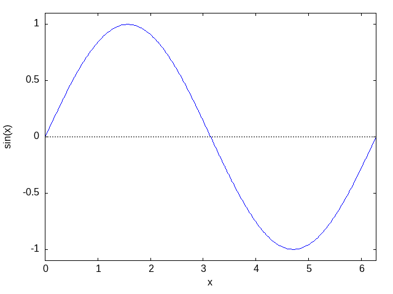

# ---
#+TITLE: org-babel Maxima demo
#+SUBTITLE:  Maxima Source Code Blocks in Org Mode
#+AUTHOR: --
#+DATE: <2024-08-28>
# ---
#+OPTIONS:    H:3 num:nil toc:2 \n:nil ::t |:t ^:{} -:t f:t *:t tex:t d:(HIDE) tags:not-in-toc
#+STARTUP:    align fold nodlcheck hidestars oddeven lognotestate hideblocks
#+SEQ_TODO:   TODO(t) INPROGRESS(i) WAITING(w@) | DONE(d) CANCELED(c@)
#+TAGS:       Write(w) Update(u) Fix(f) Check(c) noexport(n)
#+LANGUAGE:   en
#+HTML_LINK_UP:    index.html
#+HTML_LINK_HOME:  https://orgmode.org/worg/
#+EXCLUDE_TAGS: noexport
#+PROPERTY: header-args:org :exports code :results replace

#+BEGIN_QUOTE
*NOTE*
- to toggle image view: Ctrl-c Ctrl-x Ctrl-v
- to toggle LaTeX view: Ctrl-c Ctrl-x Ctrl-l
- to export as LaTeX file: Ctrl-c Ctrl-e l l
- to export as pdf file: Ctrl-c Ctrl-e l p
- to export as pdf file and view: Ctrl-c Ctrl-e l o
#+END_QUOTE
* REFERENCES
** Maxima References
- [[https://maxima.sourceforge.io/ext/maxima.pdf][Maxima Manual]]
- [[https://home.csulb.edu/~woollett/mbe.html][Maxima by Example]]
- [[https://arachnoid.com/maxima/][Symbolic Mathematics Using Maxima]]
- [[https://www.austromath.at/daten/maxima/zusatz/Graphics_with_Maxima.pdf][Graphics with MAXIMA]]
** org-mode References
- [[https://orgmode.org/worg/org-contrib/babel/languages/ob-doc-maxima.html][Maxima Source Code Blocks in Org Mode]]

  
* SOURCES
** ob-maxima documentation site
- [[https://git.sr.ht/~bzg/worg/tree/master/item/org-contrib/babel/languages/ob-doc-maxima.org][Maxima Source Code Blocks in Org Mode [main site]​]]
- [[https://github.com/bzg/worg/blob/bb243c3cbc9c41e4fb445981a590688233127ac7/org-contrib/babel/languages/ob-doc-maxima.org#L68][Maxima Source Code Blocks in Org Mode [mirror]​]]
- [[https://raw.githubusercontent.com/bzg/worg/bb243c3cbc9c41e4fb445981a590688233127ac7/org-contrib/babel/languages/ob-doc-maxima.org][Maxima Source Code Blocks in Org Mode [source]​]]

* Examples of Use

** Calculator
The following source code block uses =maxima= as a calculator for
powers of 12, where the powers are passed with a variable.

#+name: test-maxima
#+header: :exports results
#+header: :var x=1.3121254
#+begin_src maxima 
  programmode: false;
  print(12^x);
#+end_src

#+RESULTS: test-maxima
: 26.06280316745401

** Solver
Of course, =maxima= is more than a calculator.

#+name: solve-maxima
#+header: :exports results
#+begin_src maxima :results output
  programmode: false;
  eq: x**2-16 = 0;
  solution: solve(eq, x);
  print(solution);
#+end_src

#+RESULTS: solve-maxima
: solve: solution:
:                                     x = - 4
:                                      x = 4
: [%t1, %t2] 

** 3D plots
With =gnuplot= installed (4.0 or higher), 3D graphics are possible.
This example is from [[http://maxima.sourceforge.net/maxima-gnuplot.html][a tutorial on the maxima/gnuplot interface]].

#+name: 3d-maxima
#+header: :file images/maxima-3d.png
#+header: :exports results
#+header: :results file graphics
#+begin_src maxima 
  programmode: false;
  plot3d(atan(-x^2+y^3/4),[x,-4,4],[y,-4,4],[grid,50,50],[gnuplot_pm3d,true]);
#+end_src

#+RESULTS: 3d-maxima

** Inline Display of Maxima LaTeX Output
  [[http://maxima.sourceforge.net/][Maxima]] code can be evaluated and displayed inline in Org mode
  through babel [fn:1] as in the example below, based on RS initial
  example.

#+NAME: tex-maxima
#+HEADER: :exports results
#+BEGIN_SRC maxima :results raw
  tex(exp(-x)/x);
#+END_SRC

#+RESULTS: tex-maxima
$${{e^ {- x }}\over{x}}$$

* TODO Not Working Examples

** TODO The =:batch= header argument
Setting the =:batch= header argument to =batch=:
- allows the use of the =:lisp= reader;
- provides a more verbose output;
- allows one to typeset calculations in LaTeX.

*** An example with the =:lisp= reader
Sample code block:

#+RESULTS: batch-maxima.org
#+NAME: batch-maxima
#+HEADER: :batch batch
#+HEADER: :exports results
#+HEADER: :results raw
#+HEADER: :wrap example
#+BEGIN_SRC maxima
  (assume(z>0), integrate(t^z*exp(-t),t,0,inf));
  :lisp $%
#+END_SRC

#+RESULTS: batch-maxima
#+begin_example
incorrect syntax: : is not a prefix operator
SpaceSpace:l
  ^
#+end_example

The first line of input computes the integral \(\int_0^{\infty}
t^z\,e^{-t}\,dt\), assuming that \(z\) is positive.  The second input
line uses the =:lisp= reader to print the internal representation of
that result as a sexp.

*** An example with line numbering
By default, the command-line option =--very-quiet= is passed to the
Maxima executable; this option suppresses the output of the start-up
banner and input/output labels.  That can be modified by setting
=:cmdline --quiet=, which allows printing of input/output labels.

Sample code block:

#+RESULTS: batch-quiet-maxima.org
#+NAME: batch-quiet-maxima
#+HEADER: :batch batch
#+HEADER: :exports results
#+HEADER: :results raw
#+HEADER: :wrap example
#+HEADER: :cmdline --quiet
#+BEGIN_SRC maxima
  rat(1/(x+1) + x/(x-1));
#+END_SRC

#+RESULTS: batch-quiet-maxima
#+begin_example
#+end_example

Maxima's default is to print input in linear (or 1d) fashion, while
output is printed in 2d.

*** LaTeX output

To produce LaTeX output for an extended computation, one needs to
set-up a LaTeX printer.  This example uses the ~alt-display~ package
to do that.  To print output as LaTeX, Maxima's 2d printer is replaced
with ~org_tex_display~; to ensure input lines are not echoed, its 1d
printer is replaced with a sink, ~org_no_display~ (see also this
[[batch-note][Note]]).

Tangle this code block (=C-u C-c C-v t=):

#+comment: Ensure the block is evaluated (C-c C-c) after a change.
#+comment: Move to the results block and tangle it (C-u C-c C-v t)
#+RESULTS: maxima-initialize.lisp.org
#+NAME: maxima-initialize.lisp
#+HEADER: :tangle ./maxima-initialize.lisp
#+HEADER: :exports none
#+HEADER: :eval none
#+begin_src maxima
#$(load("alt-display.mac"),
define_alt_display(org_no_display(output_form), ""),
define_alt_display(org_tex_display(output_form),
  block([],
  printf(true,"~&#+begin_example~%(~a~d)~%",outchar,linenum),
  printf(true,"~&#+end_example~%"),
  tex(second(output_form)))),
set_alt_display(2,org_tex_display),
set_alt_display(1,org_no_display));#$
#+end_src

#+RESULTS: maxima-initialize.lisp
| incorrect | syntax: | # | is | not | a | prefix | operator |
| #         |         |   |    |     |   |        |          |
| ^         |         |   |    |     |   |        |          |

Next, write a Maxima code block that sets the =:cmdline= header to
read in the initialization code that was just tangled.

#+RESULTS: batch-latex-maxima.org
#+NAME: batch-latex-maxima
#+HEADER: :batch batch
#+HEADER: :exports results
#+HEADER: :results raw
#+HEADER: :wrap maximablock
#+HEADER: :cmdline --quiet --preload-lisp ./maxima-initialize.lisp
#+BEGIN_SRC maxima
  (assume(z>0), 'integrate(t^z*exp(-t),t,0,inf) = integrate(t^z*exp(-t),t,0,inf));
  diff(%,z);
#+END_SRC

*** <<batch-note>> Note
Prior to version =5.47=, Maxima could only pre-load a lisp
file; to get around this constraint, the Maxima code is written into a
lisp file, and the =#$= reader macro is used to read the Maxima code.
In versions 5.47 and higher, the Maxima code can be put in a =.mac=
file and pre-loaded without the need for such tricks.

** The =:graphics-pkg= header argument
The =:graphics-pkg= header argument can be set to use either Maxima's
built-in =plot= package (the default), or the =draw= package.

*** TODO The =plot= package
The =plot= package is the default package that provides a simplified
interface to =gnuplot=. Here is an example that creates a =gif= file.

#+RESULTS: graphics-pkg--plot.org
#+NAME: graphics-pkg--plot
#+HEADER: :graphics-pkg plot
#+HEADER: :file images/ob-maxima-plot.gif
#+HEADER: :results graphics file
#+HEADER: :exports both
#+begin_src maxima
plot2d( sin(x), [x,0,2*%pi]);
#+end_src

#+RESULTS: graphics-pkg--plot

*** The =draw= package
The =draw= package has more features than =plot=, including an
object-oriented interface to several graphics engines, including
=gnuplot=. Here is an example that creates an =svg= file containing
the graph of a discontinuous function.

#+RESULTS: graphics-pkg--draw.org
#+NAME: graphics-pkg--draw
#+HEADER: :graphics-pkg draw
#+HEADER: :file images/ob-maxima-draw.svg
#+HEADER: :results graphics file
#+HEADER: :exports both
#+begin_src maxima
f(x) := if x>0 then cos(x) else if x<0 then 0;
draw2d(
  line_width=2, grid=true, yrange=[-1.2,1.2],
  explicit(f,x,0,%pi), explicit(f,x,-1,0),
  fill_color=white, ellipse(0,0,0.05,0.05,0,360),
  fill_color=blue , ellipse(0,1,0.05,0.05,0,360));
#+end_src

#+RESULTS: graphics-pkg--draw
[[file:images/ob-maxima-draw.svg]]

**** Note
Internally, =ob-maxima= uses the function =set_draw_defaults=.
Because this function _overwrites_ the existing defaults, using it in
code blocks with the =:graphics-pkg draw= header argument will cause
the source block evaluation to fail silently.

* Additional Notes

** Toggle inline display of latex code
    Latex code in org mode can be displayed inline by 'C-c C-x
    C-l'. To remove the inline display 'C-c C-c' is used. This is
    described further in the manual [fn:2].
** Set scale of output
    If the inline display of the equations are illegible, the scale
    can be set by customising the variable 'org-format-latex-options',
    by setting the :scale variable to a value >1.
** Export
    This exports nicely to both html (C-c C-e h h) and pdf (C-c C-e l
    p). See [fn:3] and [fn:4] in the manual.
** Noweb expansion
    _NOTE:_ I have not tested this yet, but as Eric Schulte noted on
    the mailing list: "Alternately, if you really want to get fancy
    you could use noweb expansion [fn:5] to insert the results of the
    imaxima code block into a latex code block, and then use the
    existing latex code block functionality to convert the imaxima
    output to images of different types depending on the export
    target." [fn:6]

** Footnotes
[fn:1] (info "(org)Library of Babel")
[fn:2] (info "(org)Previewing LaTeX fragments")
[fn:3] (info "(org)Exporting code blocks")
[fn:4] (info "(org)The export dispatcher")
[fn:5] (info "(org)noweb")
[fn:6] [[https://lists.gnu.org/archive/html/emacs-orgmode/2013-11/msg00893.html][Re: imaxima babel]]

