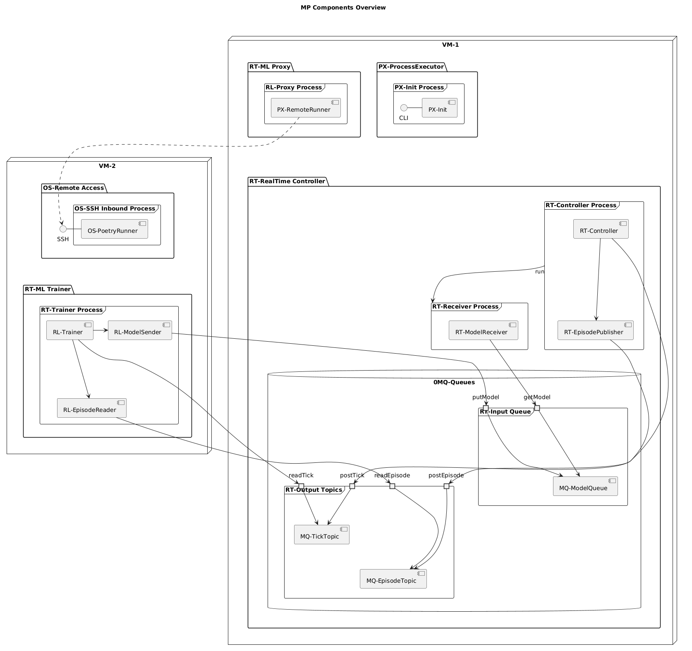

# ---
#+TITLE: py-multiproc
#+SUBTITLE:  python multiprocess ML project example
#+AUTHOR: --
#+DATE: <2024-10-09>
# ---
#+OPTIONS: toc:t h:4
#+STARTUP: show2levels
#+LINK: py-multiprocess https://docs.python.org/3/library/multiprocessing.html
#+SETUPFILE: ../../notes/ref/style.org
#+LATEX_HEADER: \def\xref{../../notes/ref/references}
#+bibliography: ../../notes/ref/references.bib

# org-export-dispatch -> latx +pdf:  C-c C-e  l p  (l o)

* PROJECT
** py-multi Notebooks

 - [[file:InterprocessQueuePerformance.ipynb::#interprocess-queue-performance][Interprocess Queue Performance]]

 - [[file:InterprocessPicklePerformance.ipynb::#interprocess-pickle-performance][Interprocess Pickle Performance]]

 - [cite:@RH362a] [[pdf:rh362-7.4-student-guide.pdf::5][Artur Glogowski (2020) Red Hat Security: Identity Management and Active Directory Integration - v7.4, Red Hat.]]
   

* Multiprocess Architecture
** MP Components
*** MP Components Overview

#+begin_src

RLModelSender -l-> RTModelReceiver: <<RL-Models>>
RTController -r-> RLTrainer: <<RT-Ticks>>
RTEpisodePublisher -r-> RLEpisodeReader: <<RT-Episodes>>
PXCLIRequestor -r-> PXInit: <<CLI-Commands>>

"PX-Init Main Process" -d-> "RT-Controller Process": run
"PX-Remote Launcer Process" -r-> "OS-SSH Inbound Process": run
"OS-SSH Inbound Process" -d-> "RT-Trainer Process": run
"PX-Init Main Process" -r-> "RL-Proxy Process": run

PXRemoteRunner .r.> OSSSHService

note left of PXCLIRequestor: optional CLI support

#+end_src

#+begin_src plantuml :file img/dia-mp-101-comp-overview.png
@startuml
!define CURRENT_SETTINGS
title MP Components Overview
'left to right direction
top to bottom direction

node "VM-1" {
        package "PX-ProcessExecutor" {
                frame "PX-Init Process" {
                        interface "CLI"                 as PXCommand
                        component [PX-Init]             as PXInit
                }        
        }        
        package "RT-RealTime Controller" {
                frame "RT-Controller Process" {
                        component [RT-Controller]       as RTController
                        component [RT-EpisodePublisher] as RTEpisodePublisher
                }        
                frame "RT-Receiver Process" {
                        component [RT-ModelReceiver]    as RTModelReceiver
                }
        database "0MQ-Queues" {
                frame "RT-Input Queue" {
                        port putModel
                        port getModel
                        component [MQ-ModelQueue]       as MQModelQueue
                }        
                frame "RT-Output Topics" {
                        port postTick        
                        port readTick        
                        port postEpisode
                        port readEpisode
                        component [MQ-TickTopic]        as MQTickTopic
                        component [MQ-EpisodeTopic]     as MQEpisodeTopic
                }        
        }        
                
        }        
        package "RT-ML Proxy" {
                frame "RL-Proxy Process" {
                        component [PX-RemoteRunner]     as PXRemoteRunner
                }        
        }
        
}

node "VM-2" {
        package "OS-Remote Access" {
                interface "SSH"                 as OSSSHService
                frame "OS-SSH Inbound Process" {
                        component [OS-PoetryRunner]     as OSPoetryRunner
                }        
        }        
        package "RT-ML Trainer" {
                frame "RT-Trainer Process" {
                        component [RL-Trainer]          as RLTrainer
                        component [RL-EpisodeReader]    as RLEpisodeReader
                        component [RL-ModelSender]      as RLModelSender
                }        
        }        
}        

"VM-2" .[hidden]l.> "VM-1"
"VM-2" .[hidden]l.> "RT-ML Proxy"
"VM-2" .[hidden]l.> "RT-Receiver Process"
"VM-2" .[hidden]l.> "0MQ-Queues"

PXCommand - PXInit
OSSSHService - OSPoetryRunner
RTController -d-> RTEpisodePublisher
RLTrainer -l-> RLModelSender
RLTrainer -d-> RLEpisodeReader

PXRemoteRunner .r.> OSSSHService

"PX-ProcessExecutor" -[hidden]d-> "RT-RealTime Controller"
"RT-ML Proxy" -[hidden]l-> "PX-ProcessExecutor"
"OS-Remote Access" -[hidden]d-> "RT-ML Trainer"
MQTickTopic -[hidden]d-> MQEpisodeTopic

"RT-Input Queue" -[hidden]d-> "RT-Output Topics"

"RT-Controller Process" -d-> "RT-Receiver Process": run

getModel --> MQModelQueue
putModel --> MQModelQueue
postTick --> MQTickTopic
readTick --> MQTickTopic
postEpisode --> MQEpisodeTopic
readEpisode --> MQEpisodeTopic

RTModelReceiver --> getModel
RLModelSender --> putModel
RTController --> postTick
RLTrainer --> readTick
RTEpisodePublisher --> postEpisode
RLEpisodeReader --> readEpisode

@enduml
#+end_src

#+RESULTS:

#+BEGIN_SRC sh

##
#
#

UP=1; apt update && apt upgrade; apy autoremove -y

date 

#+END_SRC

-----

* REFERENCES
** Notes
- [[denote:20241009T171120][30multi]]
** Library Documentation
- [cite:@PyStdMulti] Python & Stdlib (2024) multiprocessing — Process-based parallelism, .
- [cite:@ZmqDocGuide] ZeroMQ (2023) ØMQ - The Guide, .
- [cite:@ZmqDocPyZMQ] ZeroMQ (2023) PyZMQ Documentation, .
- [cite:@ZmqDocHowto] ZeroMQ (2023) Using PyZMQ, .

** Blog Articles
- [cite:@OssBlogAlter] Moraneus (2024) Understanding Multithreading and Multiprocessing in Python, .
- [cite:@OssBlogPickle] Zhe Ming Chng (2022) A Gentle Introduction to Serialization for Python, .

  
* Refs
** org-refs
print_bibliography:

** bib-refs
\nocite{*}
\bibliographystyle{IEEEtran}
\bibliography{\xref}

