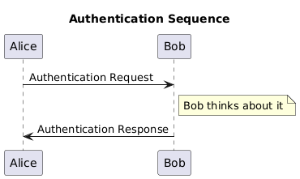

# ---
#+TITLE: py-multiproc
#+SUBTITLE:  python multiprocess ML project example
#+AUTHOR: --
#+DATE: <2024-10-09>
# ---
#+OPTIONS: toc:t h:4
#+STARTUP: show2levels
#+LINK: py-multiprocess https://docs.python.org/3/library/multiprocessing.html
#+SETUPFILE: ../../notes/ref/style.org
#+LATEX_HEADER: \def\xref{../../notes/ref/references}
#+bibliography: ../../notes/ref/references.bib

# org-export-dispatch -> latx +pdf:  C-c C-e  l p  (l o)

* @TASKS
** TODO ML proto project
*** TODO multiproc dependencies [0%]
**** TODO multiproc IPC [0/4]
 * [ ] multiproc references
 * [ ] multiproc basic ipc benchmark
 * [ ] multiproc ZMQ local benchmark
 * [ ] multiproc ZMQ distributet benchmark
**** TODO multiproc alternatives [0/3]
 * [ ] multi-thread alternative
 * [ ] multi-plex alternative
 * [ ] async alternative
*** TODO ML proto architecture [0%]
**** TODO ML proto processes [0/5]
 * [ ] ML component diagram
 * [ ] ML init activity diagram
 * [ ] ML controller activity diagram
 * [ ] ML trainer activity diagram
 * [ ] ML updater activity diagram
**** TODO ML proto configuration [0/3]
 * [ ] local init process configuration
 * [ ] distributed init process configuration
 * [ ] job descriptor distribution

* PROJECT
** py-multi Notebooks

 - [[file:InterprocessQueuePerformance.ipynb::#interprocess-queue-performance][Interprocess Queue Performance]]

 - [[file:InterprocessPicklePerformance.ipynb::#interprocess-pickle-performance][Interprocess Pickle Performance]]

 - [cite:@RH362a] [[pdf:rh362-7.4-student-guide.pdf::5][Artur Glogowski (2020) Red Hat Security: Identity Management and Active Directory Integration - v7.4, Red Hat.]]
   
 
* KUBIC Setup
** Kubic Repo Install

#+begin_src plantuml :file img/dia-001-alice-bob.png
title Authentication Sequence

Alice->Bob: Authentication Request
note right of Bob: Bob thinks about it
Bob->Alice: Authentication Response
#+end_src

#+RESULTS:

#+BEGIN_SRC sh

##
#
#

UP=1; apt update && apt upgrade; apy autoremove -y

date 

#+END_SRC

-----

* REFERENCES
** Notes
- [[denote:20241009T171120][30multi]]
** Python Standard Library
- [[https://docs.python.org/3/library/multiprocessing.html][multiprocessing — Process-based parallelism]]

  
* Refs
** org-refs
print_bibliography:

** bib-refs
\nocite{*}
\bibliographystyle{IEEEtran}
\bibliography{\xref}

