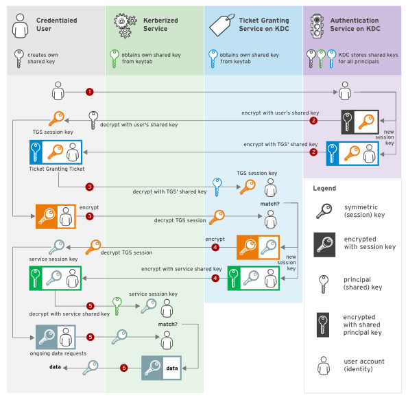

#+title:      30multi
#+date:       [2024-10-09 Wed 17:11]
#+filetags:   :<meta>:
#+identifier: 20241009T171120
STARTUP: inlineimages
#+reference:  
*#note:* 

* PROJECT

** 
 * 

 
* FIGURES
** Azure docs
** TODO Red Hat RHEL docs
*** Kerberos Authentication

#+CAPTION: Kerberos Authentication
#+NAME:   fig:rh362-v9-ch02:kerberos-authentication
#+ATTR_ORG: :width 1200

* REFERENCES
** Azure docs
** TODO Red Hat RHEL docs
 * [cite:@RhelIDMus7login] RHEL7 & Red Hat (2022) Linux Domain Identity, Authentication, and Policy Guide, .

